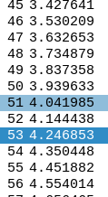

# Warum funktionert es noch nicht so gut?
Wahrscheinlich muss die Informationsgewinnung verbessert werden.
Visualisierung in knn_analysis.ipynb, um zu verstehen, wie die Daten aussehen

bessere Daten aufnehmen (linux?)
Bessere Testdatenschema (nicht nur Flur sondern auch Räume?)
Bessere Bewertung über Regressoren
Ausarbeitung
- Stand der Technik find3
A3utilities ausgeben mit korrekten ssids undso
...?
3 mal scannen und nur die APs mit signalstärke > -60 dBm benutzen

https://en.wikipedia.org/wiki/Beacon_frame :
Most access points allow the changing of the beacon interval. Increasing the beacon interval will cause the beacons to be sent less frequently. This reduces load on the network and increases throughput for clients on the network; however, it has the undesirable effect of delaying association and roaming processes as stations scanning for access points could potentially miss a beacon while scanning other channels.

Ergebnis: fast alle Beacons werden alle 102.4 ms gesendet, mit 10% varianz

TODO:
beacon frame timings aufzeichnen, um herauszufinden, warum einige verpasst werden.

starting:
airmon-ng check kill
airmon-ng start wlp4s0
airodump-ng -w wlans2 --beacons wlp4s0mon -c 6

stopping:
airmon-ng stop wlp4s0mon
systemctl start NetworkManager

Notizen
sudo iw dev wlp4s0 scan
sudo iwlist wlp4s0 scan

TODO: Code review linux_scan: wären Klassen besser als Listen? Die Indexe sind instabil gegenüber Änderugen. Klassenattributnamen ändern sich ja nicht